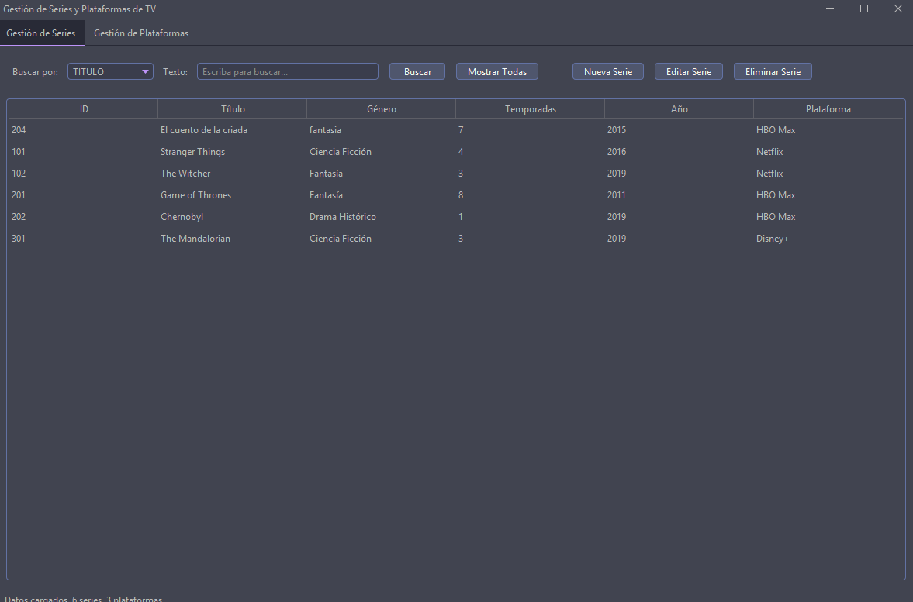
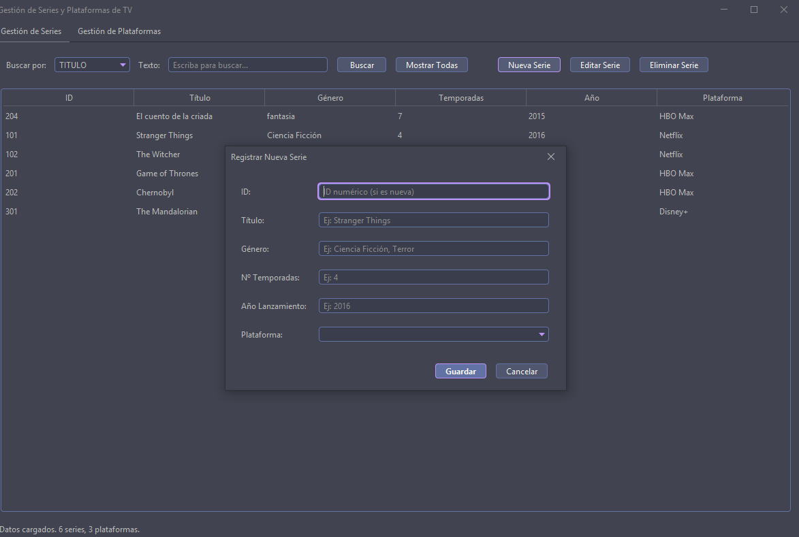
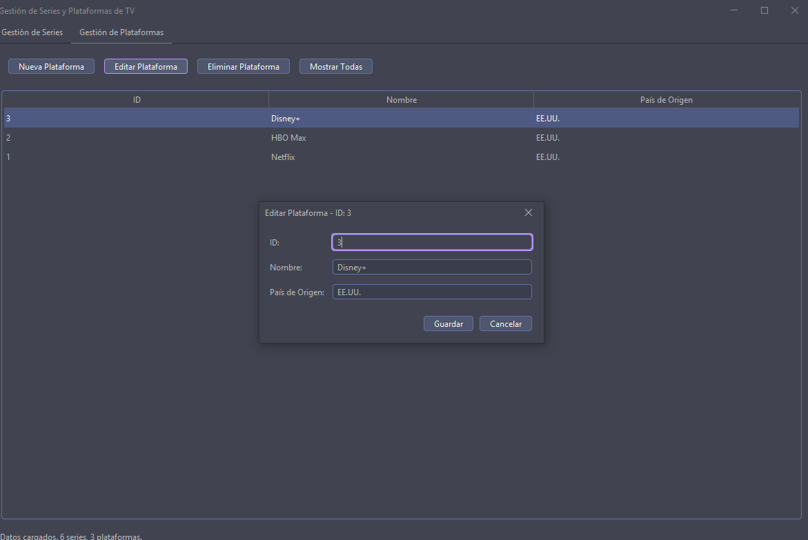

# 🎬 Gestión de Series de Televisión en Plataformas

Aplicación Java para administrar una base de datos de series disponibles en plataformas de streaming. Integra **Programación Orientada a Objetos (POO)**, conexión con **Oracle DB mediante JDBC** y una interfaz gráfica moderna con **Java Swing** y **FlatLaf**.

---


## ✨ Capturas de Pantalla de la Aplicación

Aquí puedes ver diferentes aspectos de la interfaz de usuario de la aplicación "Gestión de Series de Televisión":

### Ventana Principal
*Muestra la tabla de series, los filtros y los botones de acción principales.*


### Formulario de Serie
*Ejemplo del formulario para registrar o editar una serie, mostrando los campos de entrada y el selector de plataforma.*


### Ventana Plataforma
*Demostración de cómo se ve la ventana plataforma y edicion de Plataforma.*


---

## 🎯 Objetivo General

Desarrollar una aplicación Java completa que permita **gestionar series de televisión** mediante una base de datos relacional, aplicando los pilares del desarrollo orientado a objetos, arquitectura **MVC**, y diseño de interfaz gráfica amigable.

---

## ✅ Requisitos Funcionales

### 🔹 Programación Orientada a Objetos (POO)

- Uso de **encapsulamiento**, **herencia**, **polimorfismo** y **abstracción**.
- Clases de dominio como `Serie`, `Plataforma`, etc.
- Aplicación del **patrón MVC** (Modelo-Vista-Controlador).

### 🔹 Conexión con Oracle DB

- Conexión JDBC.
- Las tablas se crean automáticamente si no existen (con permisos adecuados).

### 🔹 Base de Datos (Modelo Relacional mínimo)

- **Tabla `Serie`**:  
  - `id` (PK), `titulo`, `genero`, `temporadas`, `año`, `id_plataforma` (FK)
- **Tabla `Plataforma`**:  
  - `id` (PK), `nombre`, `pais_origen`
- Relación: Una plataforma puede contener muchas series (1:N).

### 🔹 Interfaz Gráfica con Swing

- Formularios para alta y edición de series/plataformas con **validaciones**.
- Operaciones **CRUD completas** desde la interfaz.
- Estilo visual moderno con la librería [FlatLaf](https://www.formdev.com/flatlaf/).

---

## ✅ Funcionalidades Principales

- **Gestión de Series**: Alta, baja, modificación y consulta de series.
- **Gestión de Plataformas**: Alta, baja, modificación y consulta de plataformas de streaming.
- **Filtrado Avanzado**: Búsqueda de series por título, género y nombre de plataforma.
- **Creación Automática de Tablas**: La aplicación verifica la existencia de las tablas necesarias en la base de datos Oracle y las crea si no existen al iniciarse.
- **Interfaz Gráfica Moderna**: Uso de la librería FlatLaf para un aspecto visual contemporáneo (ej. tema Drácula, GitHub Dark, Material Deep Ocean).
- **Validaciones**: Comprobación de datos en los formularios antes de realizar operaciones en la base de datos.

---


## 📦 Estructura del Proyecto (Paquetes)

```text
com.proyecto.gestionseriestv
├── app           → Clase principal de la aplicación (MainApp.java)
├── controlador   → Clases Controladoras (SerieControl.java, PlataformaControl.java)
├── modelo        → Clases del Modelo (Entidades: Serie.java, Plataforma.java; DAOs: SeriesDao.java, PlataformasDao.java; Conexión: GestorBaseDatos.java)
└── vista         → Clases de la Interfaz Gráfica (VentanaPrincipal.java, FormularioSerie.java, FormularioPlataforma.java)

```

---


## 🛠️ Tecnologías Utilizadas

| Herramienta        | Versión / Info                  |
|--------------------|---------------------------------|
| ☕ Java             | JDK 17 (recomendado)           |
| 🧱 Maven           | Gestor de dependencias          |
| 🗃️ Oracle Database | Conexión vía JDBC (ojdbc11)     |
| 🖥️ Swing + FlatLaf | Interfaz gráfica moderna        |
| 🐙 Git + GitHub    | Control de versiones            |
| 🧪 JUnit 5         | Pruebas unitarias               |

---

## 🚀 Cómo Ejecutar el Proyecto

### 1. 📋 Prerrequisitos

* **Java JDK** (versión 21 o la especificada en tu `pom.xml`) instalado y configurado (variable de entorno `JAVA_HOME` definida).
* **Apache Maven** instalado y configurado (si vas a compilar y empaquetar desde la línea de comandos).
* **Oracle Database** (Express Edition o similar) instalada, en ejecución y accesible en la URL que configures en `GestorBaseDatos.java`.
    * Asegúrate de que el servicio de la base de datos Oracle y el Listener TNS estén iniciados.
    * Verifica que el usuario de Oracle que configures exista y tenga los permisos adecuados (como mínimo `CREATE SESSION`, `CREATE TABLE`, `CREATE SEQUENCE` (si usas secuencias), y permisos DML sobre sus objetos).
* **Oracle JDBC Driver**: La dependencia de Maven (`ojdbc11`) en el `pom.xml` debería encargarse de esto automáticamente.

### 2. 💻 Desde Eclipse (o tu IDE preferido con soporte Maven)

1.  **Clonar o Importar Proyecto**:
    * Si lo tienes en un repositorio Git: Clona el repositorio.
    * Importa el proyecto en Eclipse como un "Existing Maven Project".
2.  **Actualizar Dependencias Maven**:
    * Asegúrate de que Maven descargue todas las dependencias especificadas en el `pom.xml` (incluyendo `ojdbc11` y `flatlaf`).
    * En Eclipse, puedes hacer clic derecho en el proyecto -> "Maven" -> "Update Project...". Marca la opción "Force Update of Snapshots/Releases" y haz clic en "OK".
3.  **Configurar la Conexión a BD**:
    * Abre el archivo `src/main/java/com/proyecto/gestionseriestv/modelo/GestorBaseDatos.java`.
    * Verifica y ajusta las variables `url`, `usuario`, y `contraseña` para que coincidan con tu entorno local de Oracle.
4.  **Ejecutar**:
    * Localiza la clase `com.proyecto.gestionseriestv.app.MainApp.java`.
    * Haz clic derecho sobre ella y selecciona "Run As" -> "Java Application".


    ---
  ## 🧪 Pruebas (Testing)

La aplicación incluye una capa de pruebas para garantizar el correcto funcionamiento de las operaciones principales sobre la base de datos y la lógica del negocio. 

### 🔹 Tipos de Pruebas Implementadas

- **Pruebas Unitarias (JUnit 5)**  
  Se realizan pruebas a nivel de métodos individuales, especialmente en las clases DAO (`SeriesDao`, `PlataformasDao`) y validaciones del modelo.  
  Estas pruebas aseguran que las operaciones **CRUD** funcionen correctamente en un entorno controlado.

- **Pruebas de Integración**  
  Verifican la correcta conexión y ejecución de operaciones contra una base de datos Oracle real.  
  Requieren una instancia activa y correctamente configurada de Oracle.
---
### 🔹 Librerías Utilizadas

| Herramienta     | Uso Principal                           |
|------------------|------------------------------------------|
| `JUnit 5`        | Estructura de pruebas unitarias          |


### 🔹 Ubicación de las Pruebas

```text
src/test/java/com/proyecto/gestionseriestv/test

├── SerieDaoTest.java         → Pruebas unitarias sobre SeriesDao
├── PlataformaDaoTest.java    → Pruebas unitarias sobre PlataformasDao
```
---


## 👤 Autor

- **[Adrian Muñoz]**  


---
